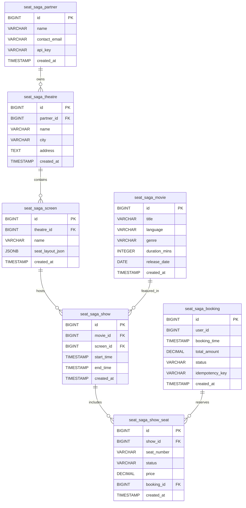

# 🎬 Seat Saga Platform

Seat Saga is a high-performance movie ticket booking platform built with **Spring Boot 4**, **PostgreSQL**, and **Docker**. It features a robust multi-stage build process, automated database migrations via Liquibase, and secure **Google OAuth2 authentication**.
migrations via Liquibase, and secure Google OAuth2 authentication.

# Seat Saga Platform

## 🚀 Quick Start (Local Environment)

We provide a custom management script to handle the build, orchestration, and database verification in one place.

### 1. Prerequisites
- Docker Desktop installed and running
- Java 21 (for the initial Gradle build)
- Google OAuth credentials configured in `application.yml`

### 2. Permissions
   Ensure the management script is executable:

   ```bash
   chmod +x seat-saga-local.sh
   ```
### 3. Launch the Platform

Build the JAR, create the Docker images, and start the services:
 ```bash
   ./seat-saga-local.sh start
 ```

## 🛠️ Management Commands
Use `./seat-saga-local.sh [command]` to manage your local instance.

### Application Management
- **start** — Compiles the app using Gradle and starts Docker containers.
- **stop** — Stops all containers without deleting data.
- **restart** — Restarts the application and database.

### Debugging & Monitoring
- **logs** — Streams live logs (useful for debugging Liquibase/Spring).
- **db-check** — Crucial: Lists all PostgreSQL tables and migration history.

### Access & Cleanup
- **urls** — Prints all active access points for the platform.
- **clean** — Wipes the environment and deletes all database volumes.

## 📊 Access Points & Monitoring

Once the platform is **UP**, access the following endpoints:

### Endpoints

- **🎬 Application** — [http://localhost:8080](http://localhost:8080)  
  Root API endpoint.

- **📚 Swagger UI** — [http://localhost:8080/swagger-ui.html](http://localhost:8080/swagger-ui.html)  
  API testing and documentation.

- **📊 Health Check** — [http://localhost:8080/actuator/health](http://localhost:8080/actuator/health)  
  Real-time system status.

- **📄 API Docs** — [http://localhost:8080/api-docs](http://localhost:8080/api-docs)  
  Raw OpenAPI spec (JSON).

### 🔐 Security & Swagger Login

The platform is secured using **Google OAuth2**. To test APIs in Swagger UI:

1. Open **Swagger UI**.
2. Click the **Authorize lock button**.
3. Select the scopes: `openid`, `profile`, and `email`.
4. Click **Authorize** — you will be redirected to the **Google Login page**.
5. After logging in, your requests in Swagger will include the necessary **Bearer token**.


## SeatSaga Database Schema
SeatSaga is a B2B2C cinema management and ticket booking platform. This repository contains the Liquibase migration scripts (YAML) that define the PostgreSQL database structure.

### 🏗️ System Architecture

The database is designed to handle a multi-tenant-like structure where partners (theatre owners) manage their infrastructure, and users can book specific seats for movie screenings.
1. **The Infrastructure Hierarchy (B2B)**
   - **Partners** (`seat_saga_partner`): The top-level entity representing a business entity or theatre chain. Each partner has a unique API key for integration. 
   - **Theatres** (`seat_saga_theatre`): Physical locations owned by a partner. 
   - **Screens** (`seat_saga_screen`): Individual auditoriums within a theatre. They store a seat_layout_json (JSONB) to handle diverse seating arrangements flexibly.

2. **The Programming Layer**
   - **Movies** (`seat_saga_movie`): Metadata for films, including duration, genre, and language. 
   - **Shows** (`seat_saga_show`): The bridge between a Movie, a Screen, and Time. This table defines exactly when and where a movie is playing.

3. **The Inventory & Booking Layer (B2C)**
   - **Show Seats** (`seat_saga_show_seat`): This is the "Inventory." When a Show is created, entries are generated here for every seat. It tracks the specific price and status (Available, Locked, Booked) for a specific show. 
   - **Bookings** (`seat_saga_booking`): Records the transaction details, including the user ID, total amount paid, and an idempotency_key to prevent double-charging/double-booking during payment processing.

.

#### 🛠️ Data Model Relationships
* **_Partner → Theatre_**: One partner can own multiple theatres.
* **_Theatre → Screen_**: One theatre contains multiple screens.
* **_Screen/Movie → Show_**: A show is a specific instance of a movie playing on a screen.
* **_Show → Show Seat_**: A show has many seats available for purchase.
* **_Booking → Show Seat_**: A booking can claim one or more show seats (linked via _`booking_id`_).

#### ⚡ Performance Optimizations
The schema includes a dedicated indexing strategy (008-indexes.yaml) to ensure the platform remains responsive under high load:

* **Seat Availability**: Optimized lookup for seat status by show.
* **Schedule Searching**: Optimized queries for start and end times.
* **User History**: Fast retrieval of bookings for specific users over time.

| Index Name                  | Table                 | Columns                   | Purpose                                           |
|-----------------------------|-----------------------|---------------------------|---------------------------------------------------|
| `idx_showseat_show_status`  | `seat_saga_show_seat` | `show_id, status`         | Fast lookup of available seats for a specific show |
| `idx_show_time`             | `seat_saga_show`      | `start_time, end_time`    | Optimizes searching for movies by time range       |
| `idx_booking_user_time`     | `seat_saga_booking`   | `user_id, booking_time`   | Speeds up user "My Bookings" history pages         |

#### ER Diagram
