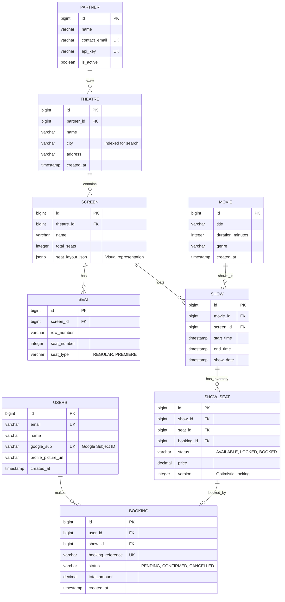

```mermaid

erDiagram
%% =================== USER MANAGEMENT ===================
    USERS ||--o{ BOOKING : makes
    USERS {
        bigint id PK
        varchar email UK
        varchar name
        varchar google_sub UK "Google Subject ID"
        varchar profile_picture_url
        timestamp created_at
    }

%% =================== B2B SIDE ===================
    PARTNER ||--o{ THEATRE : owns
    PARTNER {
        bigint id PK
        varchar name
        varchar contact_email UK
        varchar api_key UK
        boolean is_active
    }

    THEATRE ||--o{ SCREEN : contains
    THEATRE {
        bigint id PK
        bigint partner_id FK
        varchar name
        varchar city "Indexed for search"
        varchar address
        timestamp created_at
    }

    SCREEN ||--o{ SEAT : has
    SCREEN ||--o{ SHOW : hosts
    SCREEN {
        bigint id PK
        bigint theatre_id FK
        varchar name
        integer total_seats
        jsonb seat_layout_json "Visual representation"
    }

    SEAT {
        bigint id PK
        bigint screen_id FK
        varchar row_number
        integer seat_number
        varchar seat_type "REGULAR, PREMIERE"
    }

%% =================== CATALOG & INVENTORY ===================
    MOVIE ||--o{ SHOW : "shown_in"
    MOVIE {
        bigint id PK
        varchar title
        integer duration_minutes
        varchar genre
        timestamp created_at
    }

    SHOW ||--o{ SHOW_SEAT : "has_inventory"
    SHOW {
        bigint id PK
        bigint movie_id FK
        bigint screen_id FK
        timestamp start_time
        timestamp end_time
        timestamp show_date
    }

    SHOW_SEAT ||--o| BOOKING : "booked_by"
    SHOW_SEAT {
        bigint id PK
        bigint show_id FK
        bigint seat_id FK
        bigint booking_id FK
        varchar status "AVAILABLE, LOCKED, BOOKED"
        decimal price
        integer version "Optimistic Locking"
    }

%% =================== TRANSACTIONS ===================
    BOOKING {
        bigint id PK
        bigint user_id FK
        bigint show_id FK
        varchar booking_reference UK
        varchar status "PENDING, CONFIRMED, CANCELLED"
        decimal total_amount
        timestamp created_at
    }

```